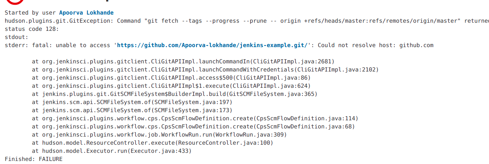

*** Objective***

The aim of this section is to perform dynamic analysis using DAST tools on DVNA and solve the 6th point of the [Problem Statement](https://devsecops-report.netlify.app/problem-statements/).

#  Dynamic Analysis

Dynamic analysis is the process of testing and evaluating a program while software is running. Also referred to as dynamic code scanning, dynamic analysis improves the diagnosis and correction of bugs, memory issues, and crashes of an application during its execution.

## Why is Dynamic Analysis Needed?
- Dynamic application security testing (DAST) is a method of AppSec testing that examines an application while it’s running, without knowledge of the application’s internal interactions or designs at the system level, and with no access or visibility into the source program.
- This “black box” testing looks at an application from the outside in, examines its running state, and observes its responses to simulated attacks made by the tool. An application’s responses to these simulations help determine whether the application is vulnerable and could be susceptible to a real malicious attack. 

## Static Vs Dynamic Analysis 

Static code analysis is done by examining the code without the need to execute the program. The process provides an understanding of the code structure and can help ensure that the code adheres to industry standards. All code is scanned to check for any vulnerabilities and ensure the code is validated.  

Dynamic analysis adopts the opposite approach and is executed while a program is in operation. Dynamic analysis performs continuous and concurrent risk assessments, searching for vulnerabilities within web applications and speeding interventions. 

## OWASP ZAP

- ZAP is an open source tool which is offered by OWASP (Open Web Application Security Project), for penetration testing of your website/web application. It helps you find the security vulnerabilities in your application.
- ZAP creates a proxy server and makes your website traffic pass through that server. It comprises of auto scanners that help you intercept the vulnerabilities in your website.
  
I followed the [official documentation](https://www.zaproxy.org/docs/docker/about/) and pulled the ZAP image from docker:

    docker pull owasp/zap2docker-stable

I got an permission denied error, and resolved it by changing the permissions as below:

    sudo chmod 666 /var/run/docker.sock
        
We will be performing a [baseline-scan](https://www.zaproxy.org/docs/docker/baseline-scan/) in a CI/CD environment as it is ideal:

    sudo docker run --rm -d -u zap --name owasp-zap -v ~/:/zap/wrk/ owasp/zap2docker-stable zap-baseline.py -t http://192.168.1.55:8080 -r zap-report.html -l PASS

- Docker files used:
  - `--rm` to  remove container after completion.
  - `-d `to run as a background job.
  - `-u` to specify user to run container as.
  - `-v` to 'host dir':'container dir', mount volumes.
- Zap CLI flags used:
  - `-t 'target'` to specify target to scan.
  - `-r 'file.html'` to generate an HTML output report.
  - `-l level` to minimum level to show: PASS, IGNORE, INFO, WARN or FAIL.

To run a fullscan script, run the following command:

    sudo docker run --rm -d -u zap --name owasp-zap -v ~/:/zap/wrk/ owasp/zap2docker-stable zap-full-scan.py -t http://192.168.1.55:8080 -r zap-report.html -l PASS

The `report` created `zap-report.html` will be saved in the home directory after successfull completion!

## DAST Pipeline

***NOTE***: While adding the script to the pipeline I got an error:

It was an DNS error, I went ahead and resolved it by the folleing command in the `<jenkins-home-dir>`:

    sudo dhclient enp0s3

Finally, I added the script to the jenkins file to perform DAST on DVNA:

    stage('ZAP Scan') {
        steps {
        sh 'docker run --rm -i -u zap --name owasp-zap -v ~/reports/:/zap/wrk/ owasp/zap2docker-stable zap-baseline.py -t http://192.168.1.55:8080 -r zap-report.html -l PASS || true'
        }
    }