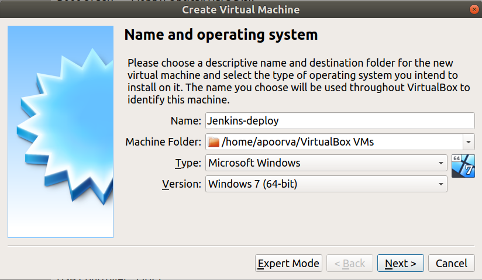

# Static Application Security Testing(SAST)

SAST is a testing methodology that analyses source code, byte code and binaries for bugs and design errors to find [security vulnerabilities](https://www.synopsys.com/blogs/software-security/types-of-security-vulnerabilities/), before the application is compiled. 

SAST does not require a working application and can take place without code being executed. It helps developers identify vulnerabilities in the initial stages of development and quickly resolve issues without breaking builds or passing on vulnerabilities to the final release of the application.

## SAST Tools for Node.js Applications

As given the name Damn Vulnerable Nodejs Application, it is quite obvious to figure the tech stack used, Nodejs is the server-side language used along with a SQL database.  

The following are the tools used to perform static analysis on Nodejs applications with steps to install and configure them with Jenkins.

### njsscan

njsscan is a open source static security code scanner for Node.js applications. Finds insecure paatterns in Node.js code and HTML templates.

The tool is written in python, hence we need to install it using pip3:

    pip3 install njsscan 

NOTE: I got an error while installing through njsscan, I entered into the `root` directory and installed it, which worked for me or you can also create a virtual environment and install it.

After installing, I executed the tool via shell script:

    mkdir reports
    njsscan -o ~/reports/nodejsscan-report.json --json  ./dvna

I referred the document which provides us [command line options](https://github.com/ajinabraham/njsscan#command-line-options). Later, I added the script in the jenkinsfile with the following syntax:

## njsscan pipeline

## AuditJS

Audits JavaScript is a SAST tool which uses [OSS Index v3 REST API](https://ossindex.sonatype.org/rest) to identify known vulnerabilities and outdated package versions.

- To install npm and nodejs in dvna container in production server, I followed the commandsas given below, the package versions are: npm v6.14.14 and nodejs v14.17.4.

    sudo apt update
    sudo curl -sL https://deb.nodesource.com/setup_14.x | sudo -E bash -
    sudo apt install -y nodejs

- Install auditjs using npm:
  
        sudo npm install -g auditjs
- Scan the directory which holds the files for DVNA and store the scan result in ~/reports/auditjs-report.

        auditjs ossi > ~/reports/auditjs-report ./dvna

## AuditJS pipeline

## SAST Pipeline

