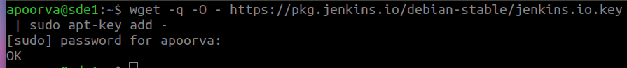
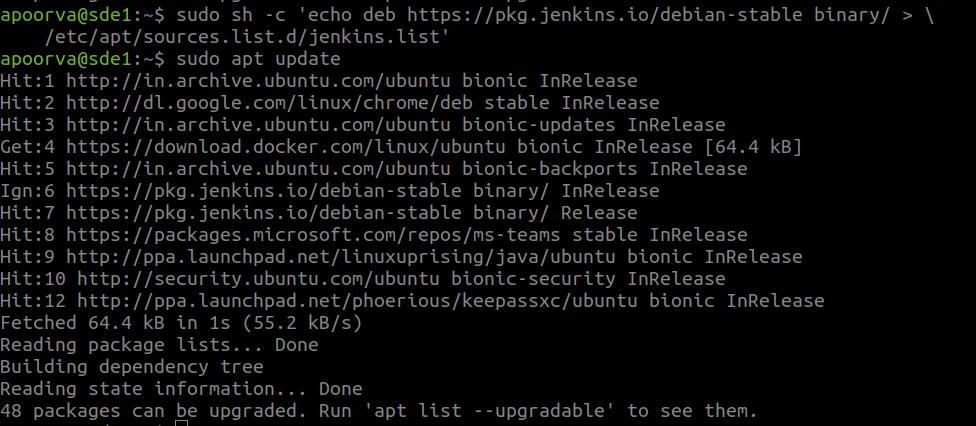
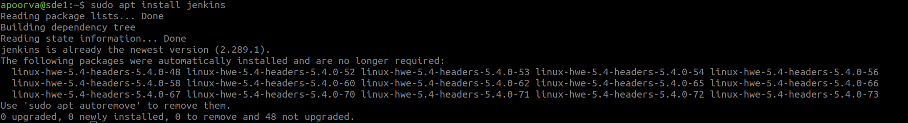
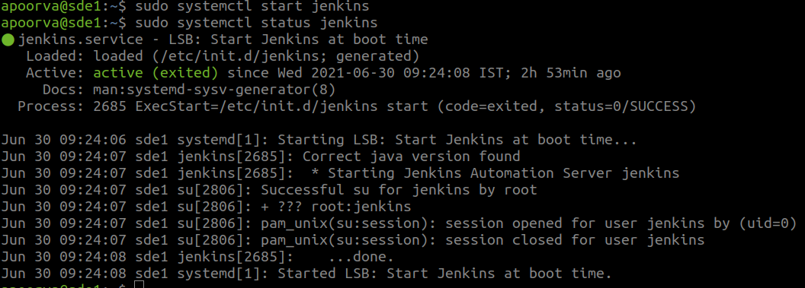
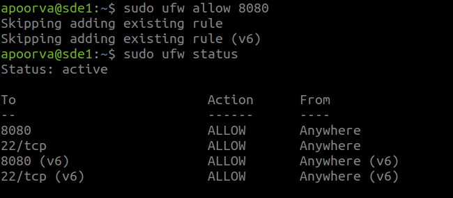

***Objective***

This section aims to set up the required infrastructure of Jenkins to perform the task and solve the 2nd point of the[Problem Statement](https://devsecops-report.netlify.app/problem-statements/).

# Installation of Jenkins 

## What is Jenkins? 

Jenkins is a self-contained, open-source automation server which can be used to automate all sorts of tasks related to building, testing, and delivering or deploying software. 

### Prerequisite 

I have setup ubuntu 18.04 VM for installing Jenkins from [Documentation](https://www.jenkins.io/doc/book/installing/). 

I have installed java 8 OpenJDK and JRE (Java Development Kit and Java Runtime Environment) which is used to develop and run the software, I have used this [Link](https://www.digitalocean.com/community/tutorials/how-to-install-java-with-apt-on-ubuntu-18-04#installing-specific-versions-of-openjdk) to download the same. 

## Installation steps for Jenkins  

Add the repository key to the terminal:  

    wget -q -O - https://pkg.jenkins.io/debian-stable/jenkins.io.key | sudo apt-key add - 

 

The system will return **OK**  

Next, add the Debian package repository address:   

    sudo sh -c 'echo deb https://pkg.jenkins.io/debian-stable binary/ > \ 
    /etc/apt/sources.list.d/jenkins.list 

    sudo apt update 

 

Now install Jenkins and it’s dependencies: 

    sudo apt install jenkins  

 

## Starting Jenkins 

The systemctl command is used to manage "systemd" services and service manager:  

    sudo systemctl start jenkins 

Check the status of Jenkins service using the below command:  

    sudo systemctl status jenkins 

  

If the Jenkins has installed successfully, then the output will show as Active: **active(excited)**. To reach it from a web browser I will adjust the firewall rules to complete the initial setup. 

## Set-up a Firewall with UFW 

Firewall is a software controlling incoming and outgoing network traffic. Firewall is able to manage traffic by monitoring network ports. 

By default, Jenkins runs on port 8080. Opening using ufw(uncomplicated firewall): 

    sudo ufw allow 8080 

To check the status of the ufw: 

    sudo ufw status 

 

If the status shows "Inactive". Then enable using following command 

To configure your server to allow incoming SSH connections, you can use this command: 

    sudo ufw allow ssh 

To enable UFW, use this command:   

    sudo ufw enable 

## Setting up Jenkins 

To find your server's name or domain name enter the following command in your terminal: 

    ifconfig  

Using the server's name or domain name as shown in the following command, entered that into a browser which in turn gave the Unlock Jenkins window. 

http://your_server_name_or_domain:8080 

### Using that server name  

 

The Unlock Jenkins window shows where the admin password is stored. In the terminal I will use the cat command to display the password: 
 
sudo cat /var/lib/jenkins/secrets/initialAdminPassword 

The 32-character alphanumeric password is displayed in the terminal, paste it onto Administrator password field, and then click **continue**.  

### Customize Jenkins  

 

In the Customize Jenkins select "install suggested plugins" which will start installation process directly and press **continue**. 

### Create Admin User  
 
 

Add the required credentials, click on **save** and continue as admin. 

The "Instance configuration" page will be displayed which will ask to confirm the preferred URL for Jenkins instance, click on **save** and **finish**. 

### Installation Starts 

 

Once the process is over click on **Reboot** which will restart the Jenkins. 

***Now, Jenkins is installed!*** 

 
 
 

 