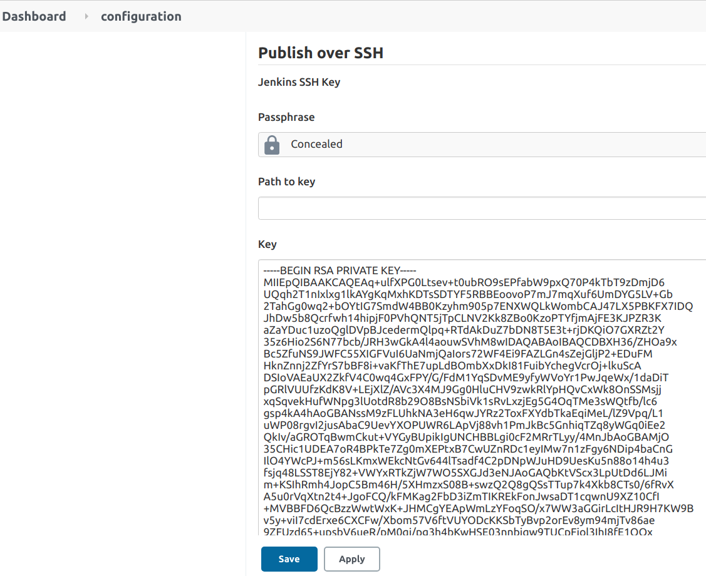
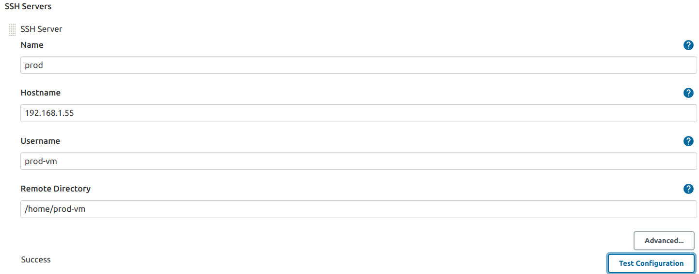

# Jenkins Pipeline

## Objective

This section aims to understand the Jenkins pipeline to deploy DVNA and solve the 4rth point of the [Problem Statement](https://devsecops-report.netlify.app/problem-statements/).

## Why use Jenkins pipeline?
Jenkins is an open continuous integration server that can support the automation of software development processes. You can create multiple automation jobs with the help of use cases, and run them as a Jenkins pipeline.

Here are the reasons why you use should use the Jenkins pipeline:

- Jenkins pipeline is implemented as a code that allows multiple users to edit and execute the pipeline process.
- Pipelines are robust. So, if your server undergoes an unforeseen restart, the pipeline will be automatically resumed.
- You can pause the pipeline process and make it wait to resume until there is input from the user.
- Jenkins Pipelines support big projects. You can run multiple jobs, and even use pipelines in a loop.

##  Setup Jenkins Pipeline

Here, we are using [Apache Maven](https://maven.apache.org/) as a plugin which is a software project management and comprehension tool. Based on the concept of a project object model (POM), Maven can manage a project's build, reporting, and documentation from a central piece of information.

Jenkins provides a particular job type, which explicitly provides options for configuring and executing a Maven project. This job type is called the `Maven project` Let’s see how we can create a Maven project in Jenkins and run the same.

### Install Maven Plugin in Jenkins

- Click on the `Manage Jenkins` -> `System Configuration` -> `Manage Plugins` options.
 
- Under the Plugin Manager, click on the Available tab and search for the maven plugin. It will show the Maven Integration plugin as a result and check the checkbox and select `install without restart`.

- Once the plugin installs successfully, click the checkbox to restart Jenkins.

- After the restart of Jenkins, the Maven Jenkins plugin will be installed successfully and ready for configuration.

### Create A Maven project in Jenkins.

- In the `Dashboard`, create a `New Item`.
  
- Now, enter `item name` as Jenkin-Maven and select Maven project as shown below, and click on `OK`.

- Under `general` section:
    - I gave the `description` of the project.
    - Under `Source Code Management` I checked the `Git` option and provided the [Github URl](https://github.com/jenkins-docs/simple-java-maven-app). This helps Jenkins to know where to fetch the project from.
   
- Under `Build Triggers`:
    - I checked `Build whenever a SNAPSHOT dependency is built` this is convenient for automatically performing continuous integration. Jenkins will check the snapshot dependencies from the dependency element in the POM, as well as plugins and extensions used in POMs.
    - Later, click on the `save` button.

## What is Jenkinsfile?

Jenkins Pipeline has a customizable and scalable automation system that lets you build distribution pipeline scripts -  `Pipeline as Code`, these scripts are called `JenkinsFile`. 
A JenkinsFile stores the entire CI/CD process as code on the local machine. As such, the file can be reviewed and checked into a Source Code Management (SCM) platform (be it Git or SVN) along with your code. Hence, the term `Pipeline as Code`.

The structure of my maven-jenkinsfile is as follows:

         
    pipeline {
        agent any

        stages {
            stage ('Compile Stage') {

                steps {
                    withMaven(maven : 'maven_3_6_0') {
                        sh 'mvn clean compile'
                    }
                }
            }

            stage ('Testing Stage') {

                steps {
                    withMaven(maven : 'maven_3_6_0') {
                        sh 'mvn test'
                    }
                }
            }

            stage ('Deployment Stage') {
                steps {
                    withMaven(maven : 'maven_3_6_0') {
                        sh 'mvn deploy'
                    }
                }
            }
        }
    }
  
- `pipeline` - Constitutes the entire definition of the pipeline.
- `agent` - Is used to choose the way the Jenkins instance(s) are used to run the pipeline. The `any` keyword defines that Jenkins should - allocate any available agent (an instance of Jenkins/a slave/the master instance) to execute the pipeline.
- `stages` - Consists of all the stages/jobs to be performed during the execution of the pipeline.
- `stage` - Specify the task to be performed.
- `steps` - This block defines actions to be performed within a particular stage.
- `sh` - Used to execute shell commands through Jenkins.
 
## SSH Access Configuration

Secure Shell Protocol (SSH) provides a secure channel over an unsecured network by using a client-server architecture, connecting an SSH client application with an SSH server. The standard TCP port for SSH is 22.
  
### Installation

- To SSH into VM we need to install it!

        sudo apt-get install openssh-server

- Enable the ssh service by:
  
        sudo systemctl enable ssh

- Start the ssh service:
  
        sudo systemctl start ssh
    
### SSH into VM

- After installing SSH, create a key pair on a client machine.
   
        ssh-keygen -t ed25519 

- The first prompt from the ssh-keygen command will ask you where to save the keys, I clicked on `enter` to save as it was.
- Similarly, `Creating passphrase` just clicked `enter`.
- Once the key is generated, place the public key on the server to which you want to connect to. Following the command below:
  
        ssh-copy-id username@your_server_address

- While copying the id I got an error "cannot create .ssh/ authorized keys permission denied", so I changed the permissions of the authorized_keys file and the folder/parent folders in which it is located.
 
        chmod 700 ~/.ssh
        chmod 600 ~/.ssh/authorized_keys
- Also, I changed the permissions of the home directory to remove write access for the group and others.
 
            chmod go-w ~

- Now, I tried sshing into the VM using the following command:

        ssh username@server_ip_address

***Note*** : While trying to ssh into the server VM, I got an error saying permission denied, I referred to this  [documentation](https://www.digitalocean.com/community/questions/ssh-permission-denied-please-try-again) and did the necessary changes which are:
                
    sudo nano /etc/ssh/sshd_config

- Changed the permissions as below:

        PermitRootLogin yes
        PasswordAuthentication yes
   
- And don't forget to reload:

        sudo systemctl restart ssh.service

### Setup SSH keys for Jenkins   
- In the jenkins web control panel, install the plugin [Publish Over SSH](https://plugins.jenkins.io/publish-over-ssh/) and nagivate to `Manage Jenkins` -> `Configure System` -> `Publish over SSH`.
  
- Either enter the path of the file e.g. `var/lib/jenkins/.ssh/id_rsa`, or add the private SSH key to the input field.

- Add SSH server details. Give the Production server's hostname (IP address), username for logging in, and remote directory (/home/prod-vm). Click on `Test Configuration` and it should return `success` as shown in the below image:

